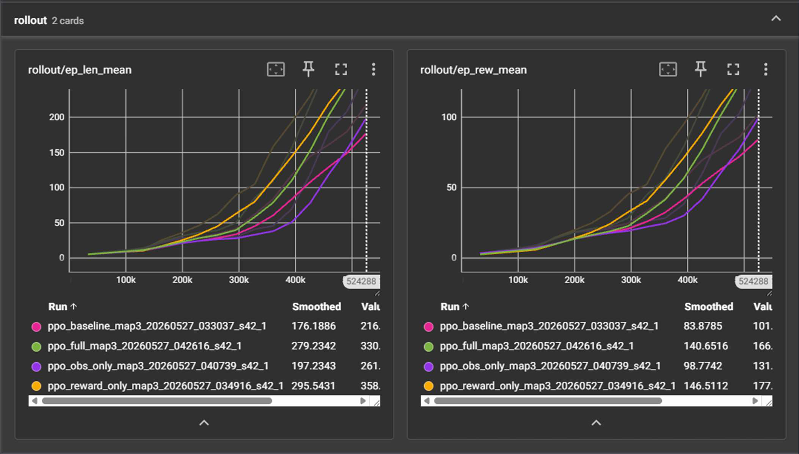
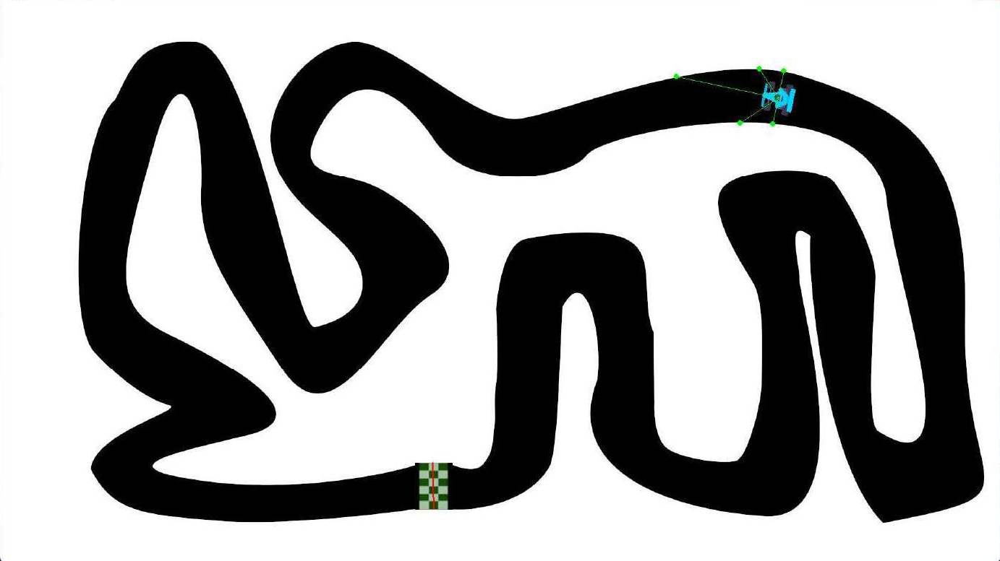

# Self-Driving Car Simulation with Deep RL — Reward vs. Observation Design

> **PPO vs NEAT — A Comparative Study of Reward Shaping and Observation Engineering**
> Deep Learning course final report · Department of Computer Science, Tunghai University
> 黃子修 · 鄭聿宏 · 侯姿佑 — June 2026

This project takes the open-source [NeuralNine/ai-car-simulation](https://github.com/NeuralNine/ai-car-simulation) — which trains a 2D self-driving car with **NEAT**, a gradient-free neuroevolution method — and rebuilds it into a standard **Gymnasium environment** trained with **PPO (Stable-Baselines3)**, turning it into a platform for systematic ablation.

With the algorithm, hyperparameters, and random seed all held fixed, we ask:

> **For PPO, does changing the reward design or changing the observation design matter more — and which aspect of policy quality does each one affect?**

We answer it with a **2×2 ablation** in which the only variables are the reward composition and the observation composition.

**Documents:** [Full written report and presentation slides](https://drive.google.com/drive/folders/1uO0yORbg89gwcLztfRHHgSC6nyjCx31R?usp=sharing) (Google Drive)

---

## TL;DR — Key Findings

1. **Reward shaping and observation augmentation are complementary, not interchangeable.** Both lift mean survival from 276 to ~437 steps — indistinguishable on the mean. The difference shows up elsewhere:
   - **Observation augmentation drives down variance** (std 88 → **5** steps), but leaves jerk high (2.25).
   - **Reward shaping keeps motion smooth** (jerk 0.82), but variance stays high (± 94).
   - Only the **`full`** condition achieves the highest mean *and* the lowest variance at once (470 ± 12).
2. **Naive PPO does not generalize across track geometries.** A policy trained on the easy oval reaches **0% crash / 1500 steps survived** in-distribution, but **100% crash / 22 ± 0.7 steps** on the winding track — it crashes at roughly the first corner.
3. **Two caveats stated up front:** all runs use a **single seed**, and at 500k steps **none of the training curves had plateaued**. These results are a **sample-efficiency comparison, not asymptotic performance.**

---

## Contributions

| Role | Person |
|---|---|
| Environment refactor (Gymnasium), PPO training pipeline, modular reward/observation design, ablation design, evaluation metrics — i.e. all code and experiments | **黃子修** |
| Presentation delivery | 鄭聿宏, 侯姿佑 |

---

## 1. Background: Why Replace NEAT with PPO?

The original project uses **NEAT** (Stanley & Miikkulainen, 2002), which applies a genetic algorithm to mutate and cross over both the weights and the topology of a neural network. The whole process is gradient-free, so strictly speaking it does not fall under deep learning.

PPO, by contrast, is a policy gradient method that updates the policy network by backpropagation. It has higher sample efficiency, and because it is differentiable it supports many kinds of fine-grained analysis that are difficult under NEAT.

| Aspect | NEAT (original) | PPO (this project) |
|---|---|---|
| Learning method | Genetic algorithm | Policy gradient |
| Parameter update | Mutation + crossover | Backpropagation |
| Gradients | None (gradient-free) | Yes (clipped surrogate) |
| Sample efficiency | Low | High |
| Deep learning | ✗ | ✓ |

**Contributions of this project:**
- Refactor a NEAT-only project into a standard Gymnasium environment with **modular** reward and observation design, so any ablation requires only a config change.
- Use a 2×2 ablation to disentangle the different roles reward shaping and observation augmentation play in policy quality.
- Quantify naive PPO's generalization failure through cross-track evaluation.

---

## 2. Problem Definition and Environment

### 2.1 Task

The car must drive on a 2D track without hitting the white boundary. Two tracks are used:

<table>
<tr>
<td width="50%"></td>
<td width="50%"></td>
</tr>
<tr>
<td align="center"><code>map.png</code> — easy oval</td>
<td align="center"><code>map3.png</code> — winding, multi-turn</td>
</tr>
</table>

The green-and-white checkered band at the bottom of each track is the start / finish line. `map3.png` plays the key role in the generalization test.

The MDP is defined as:

- **State** — 5 radar sensors at −90°, −45°, 0°, +45°, +90°, returning the distance from the car's centre to the white boundary.
- **Action** — 4 discrete actions: turn left, turn right, slow down, speed up.
- **Termination** — the car hits the white boundary, or the 1500-step cap is reached.

### 2.2 Environment Engineering

The original repo coupled the simulation logic tightly to NEAT and the pygame main loop, so PPO could not use it directly. Three refactors:

- **Gymnasium API** — implemented `reset` / `step` / `observation_space` / `action_space` so the environment can be called directly by Stable-Baselines3's PPO with no changes on the algorithm side.
- **Headless pygame** — `SDL_VIDEODRIVER=dummy` runs training without a window, and collision detection and radar distance lookups were converted from per-pixel `pygame.get_at` calls to NumPy array indexing, greatly speeding up simulation.
- **Modular components** — reward and observation are both decomposed into independently toggleable pieces controlled by a dictionary toggle. This is the foundation of the ablation: any experimental combination requires only a config change, never a code change.

---

## 3. Method

### 3.1 PPO

PPO uses an Actor–Critic architecture. The environment supplies an observation, the policy network (actor) chooses an action, and the environment returns a reward; GAE (Generalized Advantage Estimation) then estimates the advantage, and the policy is updated with a clipped surrogate objective. The clipping mechanism limits how far the policy can move in a single update, which is where the "Proximal" in the name comes from.

The policy is SB3's `MlpPolicy`, trained **on CPU**. Because the state is only 5–24 dimensions and the network is tiny (two layers of 64 units), using a GPU is actually slower due to kernel-launch and memory-transfer overhead — CPU measured faster in practice.

All ablation experiments lock the same hyperparameters to keep the comparison fair:

| Hyperparameter | Value | Hyperparameter | Value |
|---|---|---|---|
| `learning_rate` | 3e-4 | `gae_lambda` | 0.95 |
| `n_steps` | 2048 | `clip_range` | 0.2 |
| `batch_size` | 64 | `ent_coef` | 0.0 |
| `n_epochs` | 10 | `vf_coef` | 0.5 |
| `gamma` | 0.99 | `net_arch` | [64, 64] |
| `activation` | tanh | | |

### 3.2 Reward Components

Reward is the first design axis. Total reward is the sum of the enabled components, toggled from the config file; **formulas and weights are never modified during ablation**. The baseline enables only `R_progress` (mimicking the original NEAT distance fitness); `full` enables all five.

| Component | Formula | Intent |
|---|---|---|
| `R_progress` | `speed / 30` | Encourage forward travel (NEAT distance proxy) |
| `R_crash` | `−1` (on crash) | Penalize hitting the wall |
| `R_speed` | `0.01 · (speed−12)/(40−12)` | Encourage higher speed |
| `R_smooth` | `−0.05` (on action change) | Reduce jittery actions |
| `R_center` | `0.1 · (1 − \|L−R\|/(L+R))` | Reward staying mid-track |

*(L and R are the left and right radar distances.)*

### 3.3 Observation Components

Observation is the second design axis, also composable. The baseline holds only the original NEAT 5-dim radar; `full` adds speed, heading, and action history for 24 dims. Heading is encoded as sin/cos to avoid the numeric jump between 0° and 360°; action history is a one-hot encoding of the last four actions, serving as a hand-built short-term memory (a recurrence proxy).

| Component | Dims | Intent |
|---|---|---|
| `radar` | 5 | Surrounding distances (L / FL / F / FR / R) |
| `speed` | 1 | Own current speed |
| `angle` (sin/cos) | 2 | Heading, avoiding the 0°/360° jump |
| `action_history` | 16 | Last 4 actions one-hot, short-term memory |
| **Total** | **5 → 24** | baseline → full |

---

## 4. Experimental Design

Reward and observation form the two axes of a 2×2 ablation, giving four conditions. All four train on `map3` for 500k steps with the seed fixed at 42.

| Condition | Observation | Reward |
|---|---|---|
| `baseline` | radar (5) | progress only |
| `reward_only` | radar (5) | all 5 components |
| `obs_only` | full (24) | progress only |
| `full` | full (24) | all 5 components |

**Generalization evaluation.** Beyond in-distribution evaluation, a cross-track test takes the policy trained on the easy track `map` and evaluates it directly on the complex track `map3`, to check whether the policy has overfit to the training track's geometry.

**Metrics.** Each model runs 20 episodes with a deterministic policy, applying a **±15° random perturbation to the starting heading** to test robustness. The main metrics:

- **Episode length** — steps survived, reflecting the policy's ability to avoid crashing.
- **Crash rate** — proportion of episodes ending in a collision.
- **Jerk** — norm of the third difference of trajectory coordinates, quantifying smoothness.
- **Action switch rate** — proportion of consecutive steps where the action changes, reflecting decision jitter.

---

## 5. Results

### 5.1 Training Curves



*Left: `ep_len_mean`. Right: `ep_rew_mean`. Pink = baseline, green = full, purple = obs_only, orange = reward_only.*

By final `ep_rew_mean`, the ranking is **reward_only (177) > full (166) > obs_only (131) > baseline (101)**.

One point deserves emphasis: **all four curves were still rising at 500k steps with no sign of a plateau — training had not converged.** This comparison should therefore be read as one of **sample efficiency** (which learns fastest for a given step budget), not of asymptotic performance.

### 5.2 Generalization Failure

The cross-track result is striking.

| | Crash rate | Survival |
|---|---|---|
| **In-distribution** (train `map` → eval `map`) | **0%** | 1500 steps (full episode) |
| **Out-of-distribution** (train `map` → eval `map3`) | **100%** | **22 ± 0.7 steps** |

A policy trained on the easy track achieves a 0% crash rate and survives the full 1500 steps on that same track; moved to `map3`, the identical model crashes 100% of the time after an average of just 22 steps — roughly the point where the car meets its first corner. Naive PPO completely fails to generalize to a different track geometry: the policy looks flawless on its training track, but collapses the moment the shape changes.

### 5.3 Ablation Results

Because every condition has a 100% crash rate and none completes a full lap, **episode length serves as the survival proxy metric**.

| Condition | Ep len ↑ | Crash | Jerk ↓ | Action switch ↓ |
|---|---|---|---|---|
| `baseline` | 276 ± 88 | 100% | **0.85** | **32%** |
| `reward_only` | 437 ± 94 | 100% | **0.82** | **33%** |
| `obs_only` | 436 ± **5** | 100% | 2.25 | 51% |
| `full` | **470 ± 12** | 100% | 2.35 | 59% |

*Evaluation on `map3`, n = 20 episodes.*

### 5.4 Trajectory Analysis



*The `full` model on `map3`. The green line segments around the car body are the five radars; the checkered band at the bottom is the start / finish line.*

The car travels from the start point at the bottom, negotiates the several corners on the left, and reaches the upper-right region — the policy has learned to handle most of the corners in the first part of the track, but still fails on the consecutive hairpins later on. This is consistent with the §5.1 observation that training had not converged: the policy has not yet fully learned the harder parts of the track.

---

## 6. Discussion: Reward and Observation Play Different Roles

The core finding is that reward shaping and observation augmentation are **not substitutes for one another** — they act on different aspects of policy quality.

| Aspect | Reward shaping | Observation augmentation |
|---|---|---|
| Mean performance | ✓ large gain (276 → 437) | ✓ large gain (276 → 436) |
| Variance (std) | ✗ high (± 94) | ✓ **very low (± 5)** |
| Action smoothness | ✓ **low jerk (0.82)** | ✗ high jerk (2.25) |

Both lift mean survival from the baseline's 276 to roughly 437, making them **indistinguishable on the mean**. The difference appears in the variance: `reward_only`'s standard deviation actually widens to 94, while `obs_only` compresses it from 88 down to 5 — reducing variance is the *observation* axis's function, not the reward axis's. On smoothness the situation reverses: `reward_only` has low jerk thanks to the `R_smooth` penalty, while `obs_only`, lacking any smoothness signal, is jerkier.

So: **reward drives absolute performance, observation drives robustness.** Only the `full` condition (470 ± 12), which uses both, achieves the highest mean and the lowest variance among the four. This echoes the classic argument in RL about representation learning versus reward engineering — the two solve different problems and should not be treated as substitutes.

The cross-track failure in §5.2 further suggests that a PPO policy trained on a single track learns something highly **track-specific**. Since the observation contains only local radar information and training introduced no track diversity, the policy has likely memorized the training track's particular sequence of corners rather than learning a general "follow the wall" principle.

---

## 7. Limitations

Stated honestly — these are directions for future work, not a retraction of the results.

1. **Single random seed.** The standard practice for RL reproducibility is 3–5 seeds (Henderson et al., 2018). Given the project's time constraints, only `seed=42` was run, so seed variance cannot be estimated.
2. **500k steps is not converged.** All training curves were still rising at 500k, so the results are a sample-efficiency comparison, not an asymptotic-performance comparison.
3. **No complete lap on `map3`.** No model finished a full lap, so episode length is used as a survival proxy rather than a true lap time.
4. **Hand-tuned reward weights.** The reward component coefficients (0.05, 0.1, etc.) were set by intuition, with no weight-sensitivity ablation.

---

## 8. Future Work

1. **Domain randomization** — train across a mix of tracks to mitigate the generalization failure.
2. **Curriculum learning** — train from easy to hard (`map` → `map2` → `map3` → `map4`) so the policy progressively masters difficult corners.
3. **Recurrent policy** — replace the hand-built action history with an LSTM/GRU for more natural temporal memory.
4. **Multiple seeds and statistical testing** — repeat with 3–5 seeds and add significance tests.
5. **Hyperparameter search** — systematically sweep the PPO configuration.

---

## 9. Installation and Reproduction

### Requirements
- Python 3.8+; runs on native Windows and WSL2
- Training is headless by default — no display required
- **CPU-bound**, not GPU-bound: more CPU cores (to raise `--n-envs`) matter far more than a graphics card

```bash
git clone https://github.com/h-s-i-u/rl-car-reward-vs-observation
cd rl-car-reward-vs-observation

pip install -r requirements.txt
# trajectory_viz.py additionally needs:
pip install matplotlib pillow
```

### Train
```bash
python train.py --exp baseline --map assets/maps/map3.png \
                --timesteps 500000 --seed 42 --n-envs 16 --vec subproc
# --exp accepts: baseline / reward_only / obs_only / full
```
Output lands in `logs/ppo_{exp}_{map}_{timestamp}_s{seed}/` with `final_model.zip`, periodic checkpoints, and an `exp_config.json` recording every setting used.

Full ablation sweep (all four conditions): `./run_all.ps1`

### Evaluate
```bash
python eval.py logs/ppo_full_map3_<timestamp>_s42/final_model.zip --episodes 20
```
`eval.py` reads the observation/reward configuration back from the `exp_config.json` beside the model, so evaluation can never be silently mismatched to training. Add `--render` to watch live, or `--map` to run the cross-track generalization test.

### Visualize and monitor
```bash
python trajectory_viz.py logs/ppo_full_map3_<ts>_s42/final_model.zip --episodes 10 --out trajectory.png
tensorboard --logdir ./logs/tb/
```

---

## 10. Repository Contents

The trained models, evaluation outputs, and TensorBoard curves behind every number above are **committed to this repository**, so the results can be re-run without retraining:

| Artifact | Path |
|---|---|
| Trained policies | `logs/*/final_model.zip` |
| Evaluation metrics | `logs/*/eval_results.json` |
| Run configuration | `logs/*/exp_config.json` |
| Training curves | `logs/tb/` |

```bash
# Reproduce the §5.3 ablation table without retraining
python eval.py logs/ppo_baseline_map3_20260527_033037_s42/final_model.zip    --episodes 20
python eval.py logs/ppo_reward_only_map3_20260527_034916_s42/final_model.zip --episodes 20
python eval.py logs/ppo_obs_only_map3_20260527_040739_s42/final_model.zip    --episodes 20
python eval.py logs/ppo_full_map3_20260527_042616_s42/final_model.zip        --episodes 20

# Reproduce the §5.2 generalization test
python eval.py logs/ppo_baseline_map_20260527_010212_s42/final_model.zip --map assets/maps/map.png  --episodes 20
python eval.py logs/ppo_baseline_map_20260527_010212_s42/final_model.zip --map assets/maps/map3.png --episodes 20
```

> **Note:** `eval.py` writes `eval_results.json` next to the model without recording *which* map it evaluated on, so running the two generalization commands in sequence overwrites the first result. The committed `eval_results.json` for that run is therefore the **`map3` (out-of-distribution)** evaluation.

```
├── car_env.py              # Gymnasium env: kinematics, radar, collision,
│                           #   pluggable obs/reward, lap detection
├── configs.py              # Map metadata, locked PPO hyperparameters,
│                           #   reward/obs component sets, 4 ablation conditions
├── train.py                # PPO training entry point
├── eval.py                 # Episode length, crash rate, jerk, action switch rate
├── trajectory_viz.py       # Trajectory overlay visualization
├── lap.py                  # Standalone LapDetector (the live logic is inlined
│                           #   in car_env._check_lap)
├── tools/pick_coords.py    # Click a map to print pixel coordinates — used to
│                           #   calibrate finish lines and start poses
├── run_all.ps1             # Batch training over the four conditions
├── eval_all.ps1            # Batch cross-map evaluation
├── assets/maps/            # map.png ~ map6.png
├── docs/                   # Figures used in this README
└── logs/                   # Committed results (see table above)
```

---

## 11. References

1. J. Schulman, F. Wolski, P. Dhariwal, A. Radford, O. Klimov, "Proximal Policy Optimization Algorithms," arXiv:1707.06347, 2017.
2. J. Schulman, P. Moritz, S. Levine, M. Jordan, P. Abbeel, "High-Dimensional Continuous Control Using Generalized Advantage Estimation," *ICLR*, 2016.
3. K. O. Stanley, R. Miikkulainen, "Evolving Neural Networks through Augmenting Topologies," *Evolutionary Computation*, 10(2), pp. 99–127, 2002.
4. P. Henderson, R. Islam, P. Bachman, J. Pineau, D. Precup, D. Meger, "Deep Reinforcement Learning that Matters," *AAAI*, 32(1), pp. 3207–3214, 2018.
5. A. Raffin, A. Hill, A. Gleave, A. Kanervisto, M. Ernestus, N. Dormann, "Stable-Baselines3: Reliable Reinforcement Learning Implementations," *JMLR*, 22(268), pp. 1–8, 2021.
6. NeuralNine, "ai-car-simulation," GitHub. https://github.com/NeuralNine/ai-car-simulation
